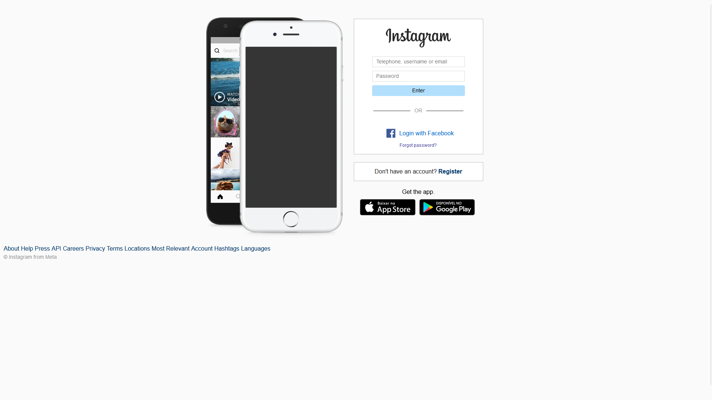

<h1 align="center"> Clone Instagram </h1>

 Website desenvolvido para praticar a criação de site baseado num design.  

  <a href="#-tecnologias">Tecnologias</a>&nbsp;&nbsp;&nbsp;|&nbsp;&nbsp;&nbsp;
  <a href="#-projeto">Projeto</a>&nbsp;&nbsp;&nbsp;|&nbsp;&nbsp;&nbsp;
  <a href="#memo-licença">Licença</a>

  
  
  
  

 

 

## 🚀 Tecnologias

Este projeto foi desenvolvido com as seguintes tecnologias: 

### Front end
- HTML
- CSS
- Git e GitHub
- SASS
- Figma

### Implantação em produção
- Front-end web: Github Pages

### Bibliotecas
- [Google Fonts](https://fonts.google.com/)

---

## 💻 Projeto

Clone do Instagram realizado para treinar minhas habilidades com HTML 5 e CSS 3 seguindo um design pronto.

## :memo: Licença

Esse projeto está sob a licença MIT.

---

Feito por Felipe Castro Ferreira em 2023 👦🏻 👋🏻 [Venha conferir meu portfólio](https://felipecastro2021.github.io/Portfolio_FelipeCastro2022/)
Last update: 16/09/2023

[Acesse meu Linkedin](https://www.linkedin.com/in/felipe-castro-ferreira/)
